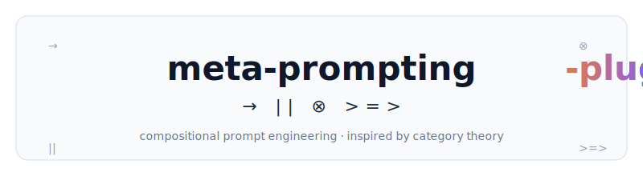
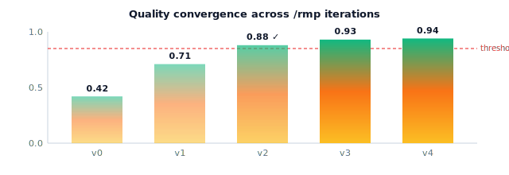

<div align="center">

<picture>
  <source media="(prefers-color-scheme: dark)" srcset="./assets/banner-dark.svg">
  
</picture>

<br>

<h3><em>Compositional prompt engineering for Claude Code.</em></h3>
<p>Five commands. Four operators. Category theory under the hood.</p>

<p>
  <a href="https://github.com/manutej/meta-prompting-plugin/releases"></a>
  <a href="./LICENSE"></a>
  <a href="https://github.com/manutej/meta-prompting-plugin/actions/workflows/validate.yml"></a>
  
  
</p>

<sub>
  <a href="#quickstart">quickstart</a> ·
  <a href="#the-5-commands">commands</a> ·
  <a href="#composition">composition</a> ·
  <a href="#the-17-skills">skills</a> ·
  <a href="#category-theory-for-the-curious">theory</a>
</sub>

</div>

---

## See it in one chain

```bash
/chain [/meta→/rmp→/review] @quality:0.9 "add rate limiting to /api/login"
```

```mermaid
flowchart LR
    U([user intent]) -->|/meta| M[classify + strategy]
    M -->|→| R[/rmp iterate]
    R -->|→| V[/review]
    V --> F([final answer])

    style U fill:#fef3c7,stroke:#d97757,color:#1e293b
    style M fill:#ede9fe,stroke:#8b5cf6,color:#1e293b
    style R fill:#e0e7ff,stroke:#6366f1,color:#1e293b
    style V fill:#cffafe,stroke:#06b6d4,color:#1e293b
    style F fill:#d1fae5,stroke:#10b981,color:#1e293b
```

<picture>
  
</picture>

Output of one is input to the next. Quality gates catch the weak link. Loops stop when they're good enough.

---

## Install

```bash
git clone https://github.com/manutej/meta-prompting-plugin ~/.claude/plugins/meta-prompting
cd ~/.claude/plugins/meta-prompting && ./INSTALL.sh
```

Restart Claude Code. Type `/meta` and you're in.

> [!NOTE]
> `v0.1.0` — early release, git-clone install. Marketplace submission lands in `v0.2`.

---

## The 5 commands

<table>
  <thead>
    <tr><th align="left">Command</th><th align="center">Symbol</th><th align="left">Does</th><th align="left">In one line</th></tr>
  </thead>
  <tbody>
    <tr>
      <td><a href="./commands/meta.md"><code>/meta</code></a></td>
      <td align="center"><code>F</code></td>
      <td>Functor <code>Task → Prompt</code></td>
      <td>Classify task complexity, pick a strategy.</td>
    </tr>
    <tr>
      <td><a href="./commands/rmp.md"><code>/rmp</code></a></td>
      <td align="center"><code>M</code></td>
      <td>Monad <code>Prompt →ⁿ Prompt</code></td>
      <td>Iterate with a quality gate until converged.</td>
    </tr>
    <tr>
      <td><a href="./commands/context.md"><code>/context</code></a></td>
      <td align="center"><code>W</code></td>
      <td>Comonad <code>History → Context</code></td>
      <td>Extract the slice of history relevant to the task.</td>
    </tr>
    <tr>
      <td><a href="./commands/transform.md"><code>/transform</code></a></td>
      <td align="center"><code>α</code></td>
      <td>Natural transformation <code>F ⇒ G</code></td>
      <td>Swap strategy without changing the task.</td>
    </tr>
    <tr>
      <td><a href="./commands/chain.md"><code>/chain</code></a></td>
      <td align="center"><code>∘</code></td>
      <td>Composition</td>
      <td>Pipe commands with <code>→</code> <code>||</code> <code>⊗</code> <code>&gt;=&gt;</code>.</td>
    </tr>
  </tbody>
</table>

---

## Composition

Four operators. Each has a precise algebraic meaning, but you only need the one-liner.

```
  →    sequential      f → g         "then"
  ||   parallel        f || g        "both, in parallel"
  ⊗    tensor          f ⊗ g         "combine states"
  >=>  Kleisli         f >=> g       "flow through, with context"
```

```mermaid
flowchart LR
    subgraph seq ["→  sequential"]
        direction LR
        a1[/meta/] --> a2[/rmp/]
    end
    subgraph par ["||  parallel"]
        direction LR
        b0([task]) --> b1[/meta A/]
        b0 --> b2[/meta B/]
        b1 & b2 --> b3([aggregate])
    end
    subgraph kle ["&gt;=&gt;  Kleisli (quality-gated)"]
        direction LR
        c1[/rmp v0/] -.q=0.42.-> c2[/rmp v1/]
        c2 -.q=0.71.-> c3[/rmp v2/]
        c3 -.q=0.88 ✓.-> c4([done])
    end

    style a1 fill:#ede9fe,stroke:#8b5cf6
    style a2 fill:#e0e7ff,stroke:#6366f1
    style b1 fill:#ede9fe,stroke:#8b5cf6
    style b2 fill:#ede9fe,stroke:#8b5cf6
    style c1 fill:#fef3c7,stroke:#f59e0b
    style c2 fill:#fde68a,stroke:#f59e0b
    style c3 fill:#fed7aa,stroke:#f97316
    style c4 fill:#d1fae5,stroke:#10b981
```

**Quality rule by operator:**

| Operator | Quality rule | Use when |
|:---:|---|---|
| `→` | `min(q₁, q₂)` — weakest link wins | Linear pipeline |
| `\|\|` | `mean(q₁, q₂, …)` — average of branches | Exploration, voting |
| `⊗` | `min(q₁, q₂)` + compound decay | Combining independent state streams |
| `>=>` | Monotone — improves iteratively | Refinement loops (`/rmp` uses this internally) |

---

## Quickstart

**1. Simple meta-prompting** — pick a strategy for a task:

```bash
/meta "implement a token-bucket rate limiter with sliding window"
```

**2. Quality-gated iteration** — refine until it's 85% or better:

```bash
/rmp @quality:0.85 @max_iterations:5 "optimize this query for cold cache"
```

**3. Chain the whole thing** — feature end-to-end, gated at every stage:

```bash
/chain [/meta→/rmp→/review] @quality:0.9 "add CSRF protection"
```

---

## Why

Most prompts die as one-shot strings. This plugin gives you structure.

| | Raw prompting | Single-command skills | **meta-prompting-plugin** |
|---|:---:|:---:|:---:|
| One-shot prompt | ✅ | ✅ | ✅ |
| Quality gating | — | sometimes | ✅ built-in (`@quality:N`) |
| Iteration until convergence | manual | — | ✅ `/rmp` |
| Command composition | — | — | ✅ `/chain` with 4 operators |
| Strategy swap mid-task | rewrite | rewrite | ✅ `/transform` |
| Context-aware focus | manual paste | — | ✅ `/context` |
| Principled algebra of behavior | — | — | ✅ category-theoretic |

---

## The 17 skills

Skills activate automatically when their description matches what you're doing. Integration skills need their external library installed first.

<details open>
<summary><b>Core — 9 skills</b> · no external deps, active by default</summary>

<br>

| Skill | Use when |
|---|---|
| [`meta-self`](./skills/meta-self/SKILL.md) | You need the master syntax reference |
| [`recursive-meta-prompting`](./skills/recursive-meta-prompting/SKILL.md) | Building self-refining AI pipelines |
| [`quality-enriched-prompting`](./skills/quality-enriched-prompting/SKILL.md) | Tracking quality across pipeline stages |
| [`prompt-dsl`](./skills/prompt-dsl/SKILL.md) | Composing prompts from reusable parts |
| [`prompt-benchmark`](./skills/prompt-benchmark/SKILL.md) | Evaluating prompts on MATH / GSM8K / Game of 24 |
| [`categorical-property-testing`](./skills/categorical-property-testing/SKILL.md) | Property-testing prompt behaviors with fp-ts + fast-check |
| [`polynomial-functors`](./skills/polynomial-functors/SKILL.md) | Designing learner compositions (Spivak-Niu) |
| [`cc2-research-framework`](./skills/cc2-research-framework/SKILL.md) | Running research workflows (Observe → Deploy) |
| [`arxiv-categorical-ai`](./skills/arxiv-categorical-ai/SKILL.md) | Analyzing AI papers systematically |

</details>

<details>
<summary><b>Integrations — 8 skills</b> · load on demand, require their library</summary>

<br>

| Skill | Requires |
|---|---|
| [`dspy-categorical`](./skills/integrations/dspy-categorical/SKILL.md) | `pip install dspy` |
| [`lmql-constraints`](./skills/integrations/lmql-constraints/SKILL.md) | `pip install lmql` |
| [`langgraph-orchestration`](./skills/integrations/langgraph-orchestration/SKILL.md) | `pip install langgraph` |
| [`guidance-grammars`](./skills/integrations/guidance-grammars/SKILL.md) | `pip install guidance` |
| [`discopy-nlp`](./skills/integrations/discopy-nlp/SKILL.md) | `pip install discopy` |
| [`effect-ts-ai`](./skills/integrations/effect-ts-ai/SKILL.md) | `npm install @effect/ai` |
| [`voltagent-multiagent`](./skills/integrations/voltagent-multiagent/SKILL.md) | `npm install voltagent` |
| [`mcp-categorical`](./skills/integrations/mcp-categorical/SKILL.md) | MCP SDK |

</details>

<details>
<summary><b>Language-ecosystem reference</b> · in <code>docs/theory/language-implementations/</code></summary>

<br>

- [`hasktorch-typed`](./docs/theory/language-implementations/hasktorch-typed/REFERENCE.md) — typed tensor ops with categorical structure (Haskell)
- [`llm4s-scala`](./docs/theory/language-implementations/llm4s-scala/REFERENCE.md) — functional LLM interfaces with Effect system (Scala)

</details>

---

## Modifiers

Every command accepts modifiers. The most-used:

```
@quality:0.85          threshold for gating
@max_iterations:5      cap on refinement loops
@mode:iterative        active | iterative | dry-run | spec
@tier:L3               force complexity tier (L1-L7)
@catch:retry:3         retry transient failures
@fallback:return-best  fallback strategy on failure
@quality:visualize     print quality flow chart
```

Full reference: [`skills/meta-self/SKILL.md`](./skills/meta-self/SKILL.md).

---

## Category theory, for the curious

> You do **not** need any of this to use the plugin. Read it if you want to know why the commands compose the way they do.

<table>
  <thead>
    <tr>
      <th align="left">Math</th>
      <th align="left">Code you already know</th>
      <th align="left">This plugin</th>
    </tr>
  </thead>
  <tbody>
    <tr><td>Functor <code>F</code></td><td><code>arr.map(f)</code></td><td><code>/meta</code></td></tr>
    <tr><td>Monad <code>M</code></td><td><code>promise.then(f)</code></td><td><code>/rmp</code></td></tr>
    <tr><td>Comonad <code>W</code></td><td><code>zipper.extract()</code></td><td><code>/context</code></td></tr>
    <tr><td>Natural transformation <code>α</code></td><td><code>Array → Promise</code></td><td><code>/transform</code></td></tr>
    <tr><td>Kleisli <code>&gt;=&gt;</code></td><td>Promise chain</td><td>operator in <code>/chain</code></td></tr>
    <tr><td>Tensor <code>⊗</code></td><td><code>Promise.all</code>-ish</td><td>operator in <code>/chain</code></td></tr>
    <tr><td><code>[0,1]</code>-enrichment</td><td>weighted graph edges</td><td><code>@quality:</code> everywhere</td></tr>
  </tbody>
</table>

<details>
<summary><b>Laws we respect</b> · click to expand</summary>

```math
\text{Functor identity:}\quad F(\mathrm{id}) = \mathrm{id}
```
```math
\text{Functor composition:}\quad F(g \circ f) = F(g) \circ F(f)
```
```math
\text{Monad associativity:}\quad (f \mathbin{>\!\!=\!\!>} g) \mathbin{>\!\!=\!\!>} h = f \mathbin{>\!\!=\!\!>} (g \mathbin{>\!\!=\!\!>} h)
```
```math
\text{Naturality:}\quad \alpha_B \circ F(f) = G(f) \circ \alpha_A
```
```math
\text{Quality monotonicity:}\quad \mathrm{quality}(A \otimes B) \le \min(\mathrm{quality}(A), \mathrm{quality}(B))
```

Full list + proofs in [`docs/theory/foundations.md`](./docs/theory/foundations.md).

</details>

---

## Docs

| Doc | For |
|---|---|
| [`docs/QUICKSTART.md`](./docs/QUICKSTART.md) | 5-min onboarding |
| [`docs/EXAMPLES.md`](./docs/EXAMPLES.md) | Real recipes |
| [`docs/theory/foundations.md`](./docs/theory/foundations.md) | Why it all composes |
| [`docs/theory/categorical-structures.md`](./docs/theory/categorical-structures.md) | Quick structure reference |
| [`docs/theory/composition-operators.md`](./docs/theory/composition-operators.md) | `→` `\|\|` `⊗` `>=>` in depth |
| [`docs/theory/further-reading.md`](./docs/theory/further-reading.md) | Papers |
| [`docs/CHANGELOG.md`](./docs/CHANGELOG.md) | Release notes |
| [`CONTRIBUTING.md`](./CONTRIBUTING.md) | How we use the plugin to build the plugin |

---

## Status & roadmap

- **v0.1.0** — plugin-only: 5 commands, 17 skills, curated theory docs. You are here.
- **v0.2.0** — TypeScript library (`@meta-prompting/core`, fp-ts based) + MCP server.
- **v0.3.0** — marketplace submission, richer quality visualizations, property-based skill tests in CI.

---

## Contributing

We used the plugin to build the plugin. The recipe is in [`CONTRIBUTING.md`](./CONTRIBUTING.md) — TL;DR: every doc, skill, and command goes through `/meta → /rmp @quality:0.85 → /transform @from:research @to:product` before it ships.

Issues, PRs, and new skills welcome. Frontmatter contract is in CONTRIBUTING.

---

## License

[MIT](./LICENSE). Built by [@manutej](https://github.com/manutej).

---

## Credits

Theory draws on: **Gavranović et al.** (ICML 2024, *Categorical Deep Learning*) · **de Wynter et al.** (2025, *On Meta-Prompting*) · **Bradley** (2021, *Enriched Category Theory of Language*) · **Spivak–Niu** (*Polynomial Functors*).

Tooling inspiration: [fp-ts](https://github.com/gcanti/fp-ts), [Effect](https://github.com/Effect-TS/effect), [DSPy](https://github.com/stanfordnlp/dspy), [LMQL](https://github.com/eth-sri/lmql), [LangGraph](https://github.com/langchain-ai/langgraph).

README visual patterns inspired by [charmbracelet/vhs](https://github.com/charmbracelet/vhs), [Aider](https://github.com/Aider-AI/aider), and [Cline](https://github.com/cline/cline). Category theory is the scaffolding, not the ladder.
