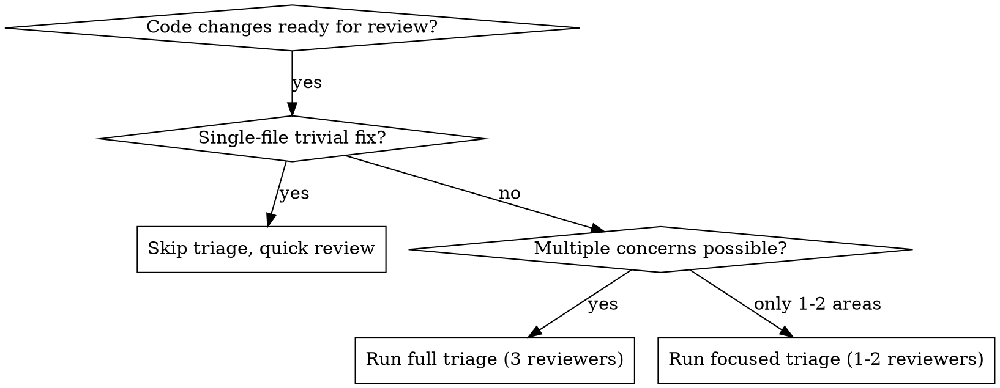

# Code Review Triage

Dispatch 3 senior engineering reviewers in parallel to catch architecture, security, and performance issues across code changes.

**Core principle:** One reviewer catches what they're trained to see. Three specialized reviewers catch what matters.

## When to Use



**Use when:**
- PR or branch has 50+ lines changed
- Changes touch auth, data handling, APIs, or infrastructure
- Pre-merge review on feature branches
- Refactoring that affects public interfaces
- New endpoints or data models

**Don't use when:**
- Typo fix, comment update, config tweak
- Already reviewed by human senior engineers
- Draft/WIP code not ready for feedback

## Usage

```
/code-review-triage [flags]
```

## Flags

| Flag | Default | Description |
|------|---------|-------------|
| `--roles <list>` | `arch,sec,perf` | Comma-separated reviewer roles to run |
| `--scope <path>` | auto-detected | Files or directories to review |
| `--base <ref>` | `origin/main` | Base branch/commit for diff |
| `--head <ref>` | `HEAD` | Head commit for diff |
| `--severity <level>` | `low` | Minimum severity to report: `critical`, `high`, `medium`, `low` |
| `--format <type>` | `summary` | Output: `summary`, `detailed`, `checklist`, `github-comment` |
| `--focus <area>` | none | Narrow review lens: `auth`, `database`, `api`, `state`, `error-handling` |
| `--sequential` | false | Run reviewers one at a time instead of parallel |

### Flag Examples

```bash
# Full triage on current branch
/code-review-triage

# Only architecture and security review
/code-review-triage --roles arch,sec

# Review specific directory with performance focus
/code-review-triage --scope src/api/ --roles perf --focus database

# PR review against develop branch, only critical/high
/code-review-triage --base origin/develop --severity high

# Generate GitHub PR comment format
/code-review-triage --format github-comment

# Review specific commits
/code-review-triage --base abc123 --head def456
```

## The Three Reviewers

### 1. Principal Architect (`arch`)

**Perspective:** System design, maintainability, correctness

**Reviews for:**
- SOLID principle violations
- Coupling and cohesion issues
- Abstraction leaks or wrong abstraction level
- API contract clarity and consistency
- Error handling completeness
- Naming and code organization
- DRY violations vs premature abstraction
- Breaking changes to public interfaces

**Severity mapping:**
- **Critical:** Breaking API change without migration path, architectural pattern violation that will cascade
- **High:** Tight coupling that blocks future changes, missing error handling on external boundaries
- **Medium:** Naming inconsistencies, minor abstraction issues
- **Low:** Style preferences, optional refactoring suggestions

### 2. Security Lead (`sec`)

**Perspective:** Attack surface, data protection, trust boundaries

**Reviews for:**
- OWASP Top 10 vulnerabilities (injection, XSS, CSRF, etc.)
- Authentication and authorization gaps
- Input validation and sanitization
- Secrets or credentials in code
- Insecure data exposure (logs, errors, API responses)
- Dependency vulnerabilities (known CVEs)
- Trust boundary violations
- Cryptographic misuse

**Severity mapping:**
- **Critical:** SQL/command injection, hardcoded secrets, auth bypass
- **High:** Missing input validation on user-facing endpoints, insecure direct object reference
- **Medium:** Verbose error messages exposing internals, missing rate limiting
- **Low:** Missing security headers, minor hardening suggestions

### 3. Performance Engineer (`perf`)

**Perspective:** Efficiency, scalability, resource management

**Reviews for:**
- Algorithmic complexity (unnecessary O(n^2) or worse)
- N+1 query patterns
- Memory leaks and unbounded growth
- Missing caching opportunities
- Blocking operations in async contexts
- Unnecessary allocations in hot paths
- Database index implications
- Connection/resource pool management
- Concurrency issues (race conditions, deadlocks)

**Severity mapping:**
- **Critical:** Unbounded memory growth, blocking event loop, race condition causing data corruption
- **High:** N+1 queries on user-facing endpoints, O(n^2) on large datasets
- **Medium:** Missing cache on repeated lookups, unnecessary allocations
- **Low:** Micro-optimizations, style-level performance preferences

## Execution Pattern

### Step 1: Gather Context

```bash
# Detect scope automatically or use --scope
BASE=${base:-origin/main}
HEAD=${head:-HEAD}

# Get the diff
git diff $BASE...$HEAD

# Get changed files
git diff --name-only $BASE...$HEAD

# Get commit messages for intent
git log --oneline $BASE...$HEAD
```

### Step 2: Dispatch Reviewers in Parallel

Launch 3 Task agents simultaneously (or subset per `--roles`):

```
# All three in a SINGLE message with multiple Task calls
Task(subagent_type="code-review-researcher", description="Arch review", prompt=ARCH_PROMPT)
Task(subagent_type="code-review-researcher", description="Security review", prompt=SEC_PROMPT)
Task(subagent_type="code-review-researcher", description="Perf review", prompt=PERF_PROMPT)
```

Each agent receives:
- The full diff
- Changed file list
- Commit messages (intent context)
- Their role-specific review checklist
- The focus area (if `--focus` specified)
- Severity threshold (if `--severity` specified)

### Step 3: Triage and Synthesize

After all agents return:

1. **Collect findings** from all three reviewers
2. **Deduplicate** overlapping findings (e.g., arch and sec both flag missing validation)
3. **Sort by severity** (critical first)
4. **Format output** per `--format` flag

## Agent Prompt Templates

### Architecture Reviewer Prompt

```markdown
You are a Principal Architect reviewing code changes. Your focus: system design, correctness, maintainability.

## Changes to Review
{diff}

## Changed Files
{file_list}

## Commit Messages (Author Intent)
{commit_log}

{focus_section}

## Your Review Checklist
- [ ] SOLID principles respected
- [ ] Coupling: are new dependencies justified?
- [ ] Abstractions: right level, no leaks?
- [ ] API contracts: clear, consistent, backward-compatible?
- [ ] Error handling: all failure modes covered at boundaries?
- [ ] Naming: intention-revealing, consistent with codebase?
- [ ] DRY: actual duplication vs coincidental similarity?
- [ ] Breaking changes: documented and migration path provided?

## Output Format
For each finding:
- **Severity:** critical | high | medium | low
- **File:** path/to/file.ts:line
- **Category:** coupling | abstraction | api-contract | error-handling | naming | solid | breaking-change
- **Finding:** What's wrong (1-2 sentences)
- **Suggestion:** How to fix (specific, actionable)
- **Code:** Before/after snippet if applicable

Minimum severity to report: {severity_threshold}

End with:
- **Summary:** 1-2 sentence overall assessment
- **Verdict:** approve | request-changes | needs-discussion
```

### Security Reviewer Prompt

```markdown
You are a Security Lead reviewing code changes. Your focus: vulnerabilities, data protection, trust boundaries.

## Changes to Review
{diff}

## Changed Files
{file_list}

## Commit Messages (Author Intent)
{commit_log}

{focus_section}

## Your Review Checklist
- [ ] Injection: SQL, command, XSS, template injection?
- [ ] Auth/Authz: authentication checked, authorization enforced?
- [ ] Input validation: all user input sanitized at boundary?
- [ ] Secrets: no hardcoded credentials, tokens, API keys?
- [ ] Data exposure: logs, errors, responses leaking sensitive data?
- [ ] Dependencies: known CVEs in new/updated packages?
- [ ] Trust boundaries: external data treated as untrusted?
- [ ] Crypto: proper algorithms, no custom crypto?

## Output Format
For each finding:
- **Severity:** critical | high | medium | low
- **File:** path/to/file.ts:line
- **Category:** injection | auth | validation | secrets | data-exposure | dependency | trust-boundary | crypto
- **Finding:** What's wrong (1-2 sentences)
- **Exploit scenario:** How an attacker could exploit this (1 sentence)
- **Suggestion:** How to fix (specific, actionable)
- **Code:** Before/after snippet if applicable

Minimum severity to report: {severity_threshold}

End with:
- **Summary:** 1-2 sentence security posture assessment
- **Verdict:** approve | request-changes | needs-discussion
```

### Performance Reviewer Prompt

```markdown
You are a Performance Engineer reviewing code changes. Your focus: efficiency, scalability, resource management.

## Changes to Review
{diff}

## Changed Files
{file_list}

## Commit Messages (Author Intent)
{commit_log}

{focus_section}

## Your Review Checklist
- [ ] Complexity: O(n^2) or worse where O(n) or O(1) possible?
- [ ] N+1 queries: loops issuing individual DB/API calls?
- [ ] Memory: unbounded buffers, missing cleanup, leaks?
- [ ] Caching: repeated expensive lookups without cache?
- [ ] Blocking: sync I/O in async context, event loop blocking?
- [ ] Allocations: unnecessary object creation in hot paths?
- [ ] Database: missing indexes implied by new queries?
- [ ] Concurrency: race conditions, deadlocks, resource contention?

## Output Format
For each finding:
- **Severity:** critical | high | medium | low
- **File:** path/to/file.ts:line
- **Category:** complexity | n-plus-one | memory | caching | blocking | allocation | database | concurrency
- **Finding:** What's wrong (1-2 sentences)
- **Impact:** Estimated impact at scale (e.g., "O(n^2) with n=10k users = 100M ops")
- **Suggestion:** How to fix (specific, actionable)
- **Code:** Before/after snippet if applicable

Minimum severity to report: {severity_threshold}

End with:
- **Summary:** 1-2 sentence performance assessment
- **Verdict:** approve | request-changes | needs-discussion
```

## Output Formats

### `--format summary` (default)

```markdown
# Code Review Triage

## Verdict: REQUEST CHANGES

**Reviewers:** Architecture, Security, Performance
**Scope:** 12 files changed, +342 -89 lines
**Base:** origin/main → HEAD (5 commits)

## Critical (1)
1. **[SEC] SQL Injection** - `src/api/users.ts:47`
   Raw user input in query template. Use parameterized queries.

## High (3)
1. **[ARCH] Breaking API Change** - `src/api/v2/orders.ts:12`
   Response shape changed without version bump. Add v3 or migration.
2. **[PERF] N+1 Query** - `src/services/order-service.ts:89`
   Loading items per order in loop. Use JOIN or batch load.
3. **[SEC] Missing Auth Check** - `src/api/admin.ts:34`
   Endpoint accessible without admin role verification.

## Medium (2)
1. **[ARCH] Tight Coupling** - `src/services/notification.ts:15`
   Direct import of email client. Use interface for testability.
2. **[PERF] Missing Index** - `src/models/order.ts:23`
   New query on `status + created_at` without composite index.

## Reviewer Summaries
- **Architecture:** Generally clean design. Breaking change in orders API needs addressing.
- **Security:** Critical SQL injection must be fixed. Auth gap on admin endpoint.
- **Performance:** N+1 pattern will degrade at scale. Index needed for new query.
```

### `--format checklist`

```markdown
# Code Review Checklist

- [ ] **CRITICAL** [SEC] Fix SQL injection in `src/api/users.ts:47`
- [ ] **HIGH** [ARCH] Version bump for API change in `src/api/v2/orders.ts:12`
- [ ] **HIGH** [PERF] Batch load orders in `src/services/order-service.ts:89`
- [ ] **HIGH** [SEC] Add admin auth check in `src/api/admin.ts:34`
- [ ] **MEDIUM** [ARCH] Decouple notification service `src/services/notification.ts:15`
- [ ] **MEDIUM** [PERF] Add composite index for order query `src/models/order.ts:23`
```

### `--format github-comment`

Outputs markdown optimized for GitHub PR comments with collapsible sections:

```markdown
## Code Review Triage: REQUEST CHANGES

> 3 reviewers analyzed 12 files (+342/-89 lines)

### Blocking Issues

| # | Severity | Reviewer | File | Issue |
|---|----------|----------|------|-------|
| 1 | Critical | Security | `users.ts:47` | SQL injection via raw user input |
| 2 | High | Security | `admin.ts:34` | Missing admin role verification |
| 3 | High | Architecture | `orders.ts:12` | Breaking API change without version bump |
| 4 | High | Performance | `order-service.ts:89` | N+1 query pattern in order loading |

<details>
<summary>Medium Issues (2)</summary>

| # | Reviewer | File | Issue |
|---|----------|------|-------|
| 5 | Architecture | `notification.ts:15` | Tight coupling to email client |
| 6 | Performance | `order.ts:23` | Missing composite index |

</details>

<details>
<summary>Reviewer Details</summary>

**Architecture:** Generally clean design...
**Security:** Critical SQL injection...
**Performance:** N+1 pattern will degrade...

</details>
```

### `--format detailed`

Full output from each reviewer with all findings, code snippets, and suggestions unabridged.

## Custom Roles

Override default roles with `--roles` using custom definitions:

```bash
# Use built-in shorthand
/code-review-triage --roles arch,sec

# The three built-in roles
# arch = Principal Architect
# sec  = Security Lead
# perf = Performance Engineer
```

To add a custom reviewer role, create a file in the skill directory:

```markdown
# ~/.claude/skills/code-review-triage/roles/data-engineer.md

Role: Data Engineer
Perspective: Data integrity, schema evolution, migration safety

Reviews for:
- Schema migration reversibility
- Data type changes that lose precision
- Missing backfill scripts
- Foreign key and constraint implications
- ETL pipeline impact

Severity mapping:
- Critical: Irreversible data loss, broken foreign keys
- High: Missing migration rollback, precision loss
- Medium: Missing index on new foreign key
- Low: Schema naming conventions
```

Then reference it:
```bash
/code-review-triage --roles arch,sec,data-engineer
```

## Focus Areas

The `--focus` flag narrows all reviewers to a specific concern domain:

| Focus | Narrows Review To |
|-------|-------------------|
| `auth` | Authentication flows, authorization checks, session management, token handling |
| `database` | Queries, migrations, indexes, connection management, transactions |
| `api` | Endpoint design, request/response contracts, versioning, error responses |
| `state` | State management, caching, concurrency, side effects |
| `error-handling` | Error propagation, recovery, logging, user-facing messages |

When `--focus` is set, each reviewer applies their expertise specifically to that domain. Example: `--focus auth` makes the architect review auth flow design, the security lead review auth vulnerabilities, and the performance engineer review auth-related bottlenecks.

## Common Mistakes

**Reviewing too much at once:**
Keep scope manageable. If 100+ files changed, use `--scope` to review in batches by directory.

**Ignoring commit messages:**
Commit messages provide intent. Reviewers use them to judge whether code matches what the author intended.

**Skipping low-severity findings:**
Low doesn't mean unimportant - it means not blocking. Track them for later. Use `--severity medium` only when you need to triage urgently.

**Running sequentially when parallel works:**
Default is parallel. Only use `--sequential` if agents would read/write the same files (rare for read-only review).

## Integration Points

**With subagent-driven development:**
Run after each task implementation to catch issues early.

**With CI/CD:**
Use `--format github-comment` to post automated triage comments on PRs.

**With requesting-code-review skill:**
This skill dispatches 3 specialized reviewers. The requesting-code-review skill dispatches 1 general reviewer. Use this when you need depth across multiple dimensions.

## Quick Reference

| Want to... | Command |
|------------|---------|
| Full review of current branch | `/code-review-triage` |
| Security-only review | `/code-review-triage --roles sec` |
| Review specific PR commits | `/code-review-triage --base abc123 --head def456` |
| Only blocking issues | `/code-review-triage --severity high` |
| PR comment format | `/code-review-triage --format github-comment` |
| Auth-focused review | `/code-review-triage --focus auth` |
| Review one directory | `/code-review-triage --scope src/api/` |
